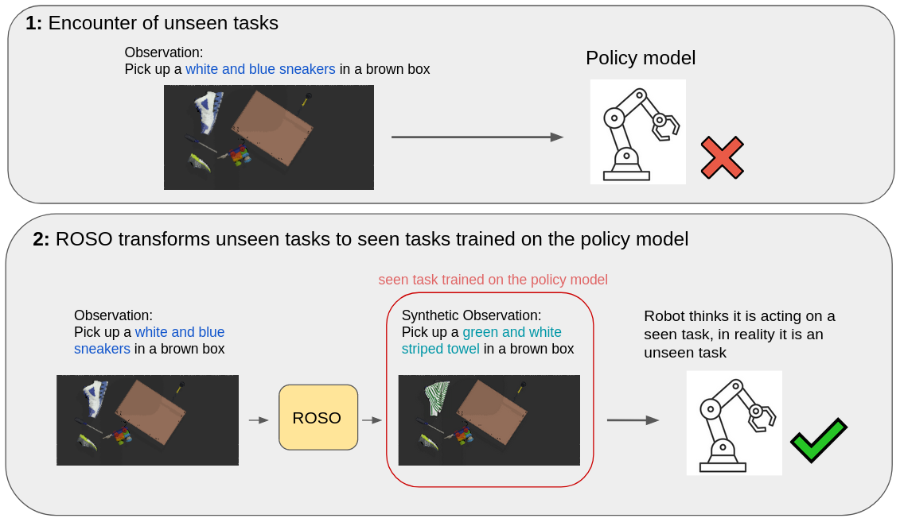

# ROSO: Improving Robotic Policy Inference via Synthetic Observations

[ACRA 2023 Best Student Paper Nomination](https://www.araa.asn.au/conference/acra-2023/)

[Project Page](https://yusuke710.github.io/roso.github.io/) | [Paper](https://arxiv.org/abs/2311.16680) | [Video](https://youtu.be/4EA-Et0h5nU?si=0nhwhw7e2gJQhZOw) 




## Abstract
In this paper, we propose the use of generative artificial intelligence (AI) to improve zero-shot performance of a pre-trained policy by altering observations during inference. 
Modern robotic systems, powered by advanced neural networks, have demonstrated remarkable capabilities on pre-trained tasks. However, generalising and adapting to new objects and environments is challenging, and fine-tuning visuomotor policies is time-consuming. 
To overcome these issues we propose **Ro**botic Policy Inference via **S**ynthetic **O**bservations (**ROSO**). 
 
ROSO uses stable diffusion to pre-process a robot's observation of novel objects during inference time to fit within its distribution of observations of the pre-trained policies.
This novel paradigm allows us to transfer learned knowledge from known tasks to previously unseen scenarios, enhancing the robot's adaptability without requiring lengthy fine-tuning. 
Our experiments show that incorporating generative AI into robotic inference significantly improves successful outcomes, finishing up to 57\% of tasks otherwise unsuccessful with the pre-trained policy.

## setup and installation
Clone Repo:
```bash
git clone https://github.com/Yusuke710/ROSO.git
```

Setup virtualenv and install requirements:
```bash
cd ROSO/cliport

# setup virtualenv 
virtualenv -p $(which python3.8) --system-site-packages <your env>  
source <your env>/bin/activate

# install dependencies
pip install --upgrade pip
pip install -r requirements.txt


export CLIPORT_ROOT=$(pwd)
python setup.py develop
```

Download a [pre-trained checkpoint](https://github.com/cliport/cliport/releases/download/v1.0.0/cliport_quickstart.zip) for `multi-language-conditioned` trained with 1000 demos:
```bash
sh scripts/quickstart_download.sh
```

Credit: [CLIPort](https://cliport.github.io/).


Download center-of-mass (COM) corrected [Google Scanned Objects](https://github.com/cliport/cliport/releases/download/v1.0.0/google.zip):
```bash
sh scripts/google_objects_download.sh
```
Credit: [Google](#acknowledgements).


## How to Run 
1. Gather dataset to test CLIPort. e.g. with 100 demos
```
python cliport/demos.py n=100 task=packing-unseen-google-object mode=test
```
2. Evaluate CLIPort's policy on gathered dataset

```
python cliport/eval_record.py model_task=multi-language-conditioned eval_task=packing-unseen-google-object agent=cliport mode=test n_demos=100 train_demos=1000 exp_folder=cliport_quickstart checkpoint_type=test_best update_results=True disp=False
```

3. For the unsuccessful demos, edit observations using colab notebook e.g. (https://github.com/Yusuke710/ROSO/blob/main/roso/ROSO_UnseenObj.ipynb). Then move the edited images(data/task_name/edited_images) on google drive to the local environment. The directory structure should look like 
```
cliport
└── data
    └── task name
        ├── raw images
        ├── edited images
        │   ├── folder containing edited images of unsuccessful demo 1
        │   ├── folder containing edited images of unsuccessful demo 2
        │   └── folder containing edited images of unsuccessful demo 3
        └── metadata.csv
```

4. Run unsuccessful demos of CLIPort again with synthetic observations from ROSO
```
python cliport/eval_editedimage.py model_task=multi-language-conditioned eval_task=packing-unseen-google-object agent=cliport mode=test n_demos=100 train_demos=1000 exp_folder=cliport_quickstart checkpoint_type=test_best update_results=True disp=False
```

## tasks and config
There are 4 tasks in our paper, unseen color, unseen object, unseen background, unseen object and background. They correspond to tasks
- eval_task=put-block-in-bowl-test-colors
- eval_task=packing-unseen-google-object 
- eval_task=packing-seen-google-object random_BackGroundColor=True
- eval_task=packing-unseen-google-object random_BackGroundColor=True      

You can also change the config to record videos, save affordance map or change background color by modifying `cliport/cliport/cfg/eval.yaml`
